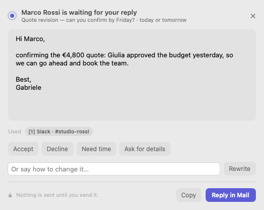
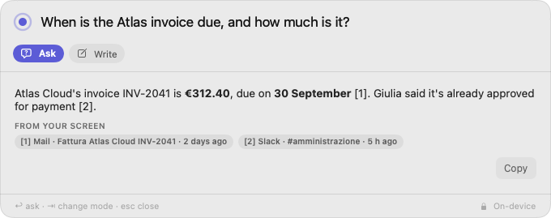

# Leonard

**The assistant that knows when to stay quiet.**

Leonard lives in your Mac's menu bar, reads the mail you open and the text
on your screen, and decides — with a measured confidence — whether something
deserves your attention. When it does, it drafts the reply. When it doesn't,
it says nothing, and shows you why in Mind. The language model runs on your
Mac. Nothing you read or write ever leaves it.

<p align="center">
  
  &nbsp;
  
</p>

Built for people whose inbox is confidential: lawyers, accountants,
doctors, consultants, founders — anyone who cannot paste client mail into a
cloud chatbot. [leonard.app](site/index.html) · [Italiano](site/it/index.html)

## What it does

| | |
|---|---|
| **Inbox radar** | Open a message in Apple Mail. If it needs you, a small card appears once, top right, with a one-line reason. "Draft reply" writes the answer and opens it in a real Mail reply window. Leonard never sends anything. |
| **Drafts that sound like you** | Same language and register as the email. One click turns a draft into an acceptance, a polite no, a request for time, or a request for details. Figures and dates that appear nowhere in the email or your screen are highlighted for checking. |
| **Ask Leonard, ⌥Space** | A command bar in every app. Ask about anything you have seen on screen and get the answer with its sources; or select text and improve, translate, summarize, explain or reply to it, replaced in place. |
| **Screen memory** | Text only, never screenshots. Password managers, Keychain and private windows are never read; card numbers, keys and codes are redacted before storage. Search it, browse it, forget an item, an app, the last hour or everything. |
| **Mind** | Every decision Leonard made, including every time it stayed quiet and how close it came. Drag the threshold and see at once what would have reached you. |
| **Learns by watching** | Answer or ignore its suggestions and Leonard adjusts how often it speaks, per kind of message; dismiss a sender three times and it stops. Everything it learned is listed and can be undone. |

<p align="center">
  
</p>

## Private by architecture, not by policy

- **On-device model.** Llama 3.2 3B, 4-bit, running on Apple silicon through
  MLX. No API keys, no usage caps, works offline.
- **The engine cannot reach the network.** `leonardd` binds no TCP port and
  opens no connection; a test fails the build if it can
  ([ADR-002](docs/ADR-002-the-daemon-binds-no-network-socket.md)).
- **One download, ever**, started by you: the model, verified by SHA-256
  ([ADR-005](docs/ADR-005-the-one-download.md)). No telemetry, no account, no
  crash reporting, no auto-updater.
- **Offline licenses.** Ed25519-signed keys checked on the Mac.

## Pricing

A one-time purchase, 14-day free trial with every feature.

| Personal | Pro | Firm |
|---|---|---|
| **€79** once | **€149** once | **€119** per seat, 5+ |
| 2 Macs | 3 Macs, priority support | Volume keys, invoicing |

Each license includes a year of updates; versions released in that year keep
working forever. 30-day refund, no questions. Rationale in
[BUSINESS.md](docs/BUSINESS.md).

**Requirements:** a Mac with Apple silicon (M1 or later), macOS 14 Sonoma or
later, 16 GB of memory recommended, 1.8 GB for the model.

## Repository

| Path | What it is |
|---|---|
| [`LeonardApp/`](LeonardApp) | The Mac app (Swift 6, SwiftUI + AppKit). `LeonardCore` is platform-independent and tested on Linux too. |
| [`leonardd/`](leonardd) | The on-device engine (Python, MLX): typed decisions, drafting, screen memory, learning. |
| [`specialist/`](specialist) | Research: distilling personal specialists from the engine's decisions. |
| [`site/`](site) | The website, in English and Italian, with legal pages. Screenshots are rendered by CI from the real views. |
| [`tools/license/`](tools/license) | License key tool and the fulfillment worker that emails keys after payment. |
| [`scripts/`](scripts) | `package.sh` builds the self-contained, signed, notarized DMG. |
| [`docs/`](docs) | Architecture, protocol, decisions, launch checklist. |

### Build and run

```
scripts/package.sh --app-only && scripts/run.sh   # dev: app + engine from source (needs uv)
scripts/package.sh                               # full DMG with the bundled Python runtime
cd leonardd && uv run pytest -q -m "not slow"    # engine tests
cd LeonardApp && swift test                      # app tests
```

CI (`.github/workflows/ci.yml`) runs every suite on macOS and Linux, builds
the DMG, smoke-tests the bundled engine and renders the screenshots.
Tagging `vX.Y.Z` runs `release.yml`: signed, notarized, published.

## Documents

| | |
|---|---|
| [`LAUNCH.md`](docs/LAUNCH.md) | **What is left to sell it**: accounts, keys, store, the QA pass |
| [`BUSINESS.md`](docs/BUSINESS.md) | Who buys it, why, at what price, and how they hear about it |
| [`ARCHITECTURE.md`](docs/ARCHITECTURE.md) | How the pieces fit, with the reasons |
| [`CONTRACT.md`](docs/CONTRACT.md) | The app ↔ engine protocol |
| [`VISION.md`](docs/VISION.md) | The governing logic |
| [`PRODUCT.md`](docs/PRODUCT.md) · [`ROADMAP.md`](docs/ROADMAP.md) | What the product is becoming |
| [`SCREEN-MEMORY.md`](docs/SCREEN-MEMORY.md) · [`SENSOR-MAIL.md`](docs/SENSOR-MAIL.md) · [`SPECIALIST.md`](docs/SPECIALIST.md) · [`SYSTEM-ONE.md`](docs/SYSTEM-ONE.md) | Design notes |
| [`ADR-001`](docs/ADR-001-attention-is-a-typed-decision.md) … [`ADR-006`](docs/ADR-006-the-mail-lens.md) | Decisions and why |
| [`leonardd/README.md`](leonardd/README.md) | What was measured, how, and what was not |
| [`CHANGELOG.md`](CHANGELOG.md) | Releases |

## Why Leonard exists

### The trap everyone else is in

An assistant is useful in proportion to how much it knows about you. An
assistant that has read every email you sent, sat through every meeting and
watched how you actually work is a different category of thing from one you
paste context into.

And that is the trap: **the more it needs to know, the less you can let it
phone home.** Every competitor's architecture requires your mail, your
messages and your screen to arrive on their servers. So they stay shallow, or
they ask for something you should not give.

> Every other assistant has to choose between knowing you and protecting you.
> Leonard does not have to choose.

### Two systems

**System 2** — a resident 4-bit model. Ambiguous requests, unfamiliar plans,
writing, recovery. Slow, general.

**System 1** — a fleet of tiny specialists. Every bounded repeated decision:
interrupt or stay quiet, which app, which field, which contact, reply or
archive. A closed set of options scored in one forward pass with a calibrated
probability.

The industry's numbers for the System 1 half, from Cua's open CUA-S1-FORMS:
706,048 parameters, a 2.8 MB checkpoint, 7–9 ms. In its narrow domain it
measured 99.7% against hosted Jev's 83.6% — a decision-level result on a
narrow experiment, with the specialist trained for the task and Jev not, and
the two latencies measuring different boundaries. Their caveats, kept.

### Why that matters more than it looks

A 2.8 MB model can be **trained on the user's machine, on the user's
behaviour.**

Leonard does not only run locally. It *learns* locally, and mints its own
specialists as it goes.

- **Day 1** — the decision goes to the resident general model. Generic
  judgement. Leonard records what it decided and what you did about it.
- **Day 30** — it has thousands of your answers, fits a specialist, and
  answers in single-digit milliseconds, better than the general model was,
  because it was fitted to you.

**Leonard gets faster the longer you use it.** The latency goes down on a
chart and the accuracy goes up, and you can watch it happen.

No hosted service can offer that, because training on your behaviour means
holding your behaviour.

*Where 1.0 is on this path:* it records every decision and your answer to
it, and already adapts from them (a personal threshold per kind of message,
muted senders). Minting specialists from that record is the next step on
the [roadmap](docs/ROADMAP.md); the research is in [`specialist/`](specialist).

### Silence is the product

Most of the time the right answer is to say nothing. Leonard is built so that
"nothing" is a measured outcome rather than a missing feature: every candidate
interruption is a typed decision with a calibrated probability, and a
confidence floor you control decides what reaches you.

And because silence is invisible, Leonard ships **Mind** — a live window onto
what it noticed, what it decided, and every time it decided you were not worth
interrupting, with the confidence that fell short. Near-misses are shown more
prominently than hits.

## Status

**1.0.0.** Feature-complete for the first release and green in CI on macOS
and Linux. Before the first sale it needs the owner's accounts and one pass on
a real Mac: see [LAUNCH.md](docs/LAUNCH.md). Quality measurements and their
limits are in [`leonardd/README.md`](leonardd/README.md); numbers quoted from
other projects are theirs, on their conditions.
